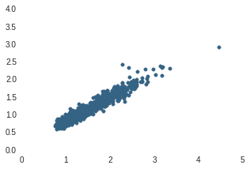

# Statistics for Engineers

by Heinrich Hartmann

## Introduction

Statistics plays a great role in modern IT operations.
Monitoring systems collect a wealth of data from
network-gear, operating systems, applications and other components,
that needs to be analyzed to derive vital information.
For example, faults need to be detected early, application
performance needs to be measured, and the capacity needed to
serve the load of next month needs to be forecasted.

Statistics is the art of extracting information from data.
Hence, it becomes key to operate a modern IT system. 
Despite the community becoming more and more aware of this
fact, resources for learning the relevant statistics for
this domain are hard to find.

In particular classical statistics appears not to be adequate.
Statistics courses at university depends on a great amount of
foreknowledge in probability-, measure- and set-theory, which
is very hard to digest. Moreover, it often focuses on 
parametric methods, like t-test that come with strong 
assumptions on the distribution of the data ('normality')
that are not met by operations data.

This lack of relevance can be explained by history.  The origins of
statistics reach back to the 17-century, where computation was very
expensive and data was a very sparse resource.  So mathematicians
spent a lot of effort at avoiding calculations.  The setting has has
changed radically and allows different approaches to statistical
problems.

Have a look at this example form the book [1] used at my statistics
class at university:

> An fruit-merchant gets a delivery of 10.000 oranges.
> He want's to know how many of those are rotten.
> To do so he takes a sample of 50 oranges, and counts the
> number of rotten ones x? Which deductions can he make
> about the total number of rotten oranges?

The chapter goes on with explaining various inference methods.
The example translated to our domain would go as follows:

> A db admin want's to know how many requests took longer
> than one second to complete. He measures the duration of all
> requests and count's the number of those which took longer
> than one second. Done.

The abundance of computing resources has completely eliminated
the need for elaborate estimations.

Therefore, we will to take a different approach to Statistics
in this article. Instead of presenting text book material, I'll
present a few episodes of relevant descriptive statistical methods
that are accessible and relevant for case in point. I have
tried to keep the mathematical prior knowledge to a minimum,
by e.g. replacing formulas by source code whenever feasible.

## Episode 1 -- Visualizing Data

The most essential data analysis method is visualization.
The human brain can process geometric information much more
rapidly than numbers or language. When presented with a suitable
visualization we can capture relevant properties, like
typical values and outliers almost instantly.

In this episode we will run through the basic plotting methods and
discuss their properties. For producing the plots, we have chosen to
use the python toolchain ([ipython](http://ipython.org),
[matplotlib](http://matplotlib.org), and
[seaborn](http://stanford.edu/~mwaskom/software/seaborn/)).  We will
not show you, however, how to use this tools.  There are a lot of
alternative plotting tools (R, MATLAB) with accompanying tutorials
available online.  Source code an datasets can be found on <a
href="http://github.com/HeinrichHartmann/Statistics-for-Engineers">
GitHub.</a>

### Rug plots

The most basic visualization method of a one-dimensional dataset `X =
[x_1, ... ,x_n]` is the rug plot (cf. Figure 1). A rug plot consists of
a single axis on which little lines, called 'rugs' are drawn for each
sample.

<figure>

<figcaption>Figure 1: A Rug Plot of web-requests rates</figcaption>
</figure>

Rug plots are suitable for all questions where the ordering of the samples is not relevant, like common values or outliers.
Problems occur if there are multiple samples with the sample
value in the dataset. Those samples will be indistinguishable
in the rug plot. This problem can be addressed by adding a
small random displacement (jitter) to the samples.

Despite it's simple and honest character, the rug plot is not very
commonly used in practice, instead histograms or line plots are
used, even if a rug-plot would have been more suitable.

### Histograms

Histograms are a popular visualization method for unordered
one-dimensional data. Instead of drawing rugs on an axis,
the we divide the axis into bins, and draw bars of a
certain height on top of them, so that the number of
samples within a bin is proportional to the area of the bar (cf. Figure 2).

<figure>

<figcaption>Figure 2: Histogram</figcaption>
</figure>

The use of a second dimension makes the histogram in
many cases easier to comprehend than a rug plot. In
particular, questions like: "Which ratio of the samples
lies below y?" can be effectively estimated by comparing
areas. This convenience comes at the expense of an
extra dimension used and additional choices that
have to be made about value ranges and bin sizes.

There is a lot more to tell about histograms, and our next
episode is entirely devoted to this topic.

### Scatter plot

The scatter plot is the most basic visualization of a two-dimensional
dataset. For each pair `x,y` of values we draw a point on a canvas,
that has coordinates `(x,y)` in a Cartesian coordinate system.

<figure>


<figcaption>Figure 3: Scatter plots of request rates of two database nodes in samples per second.</figcaption>
</figure>

Scatter plot are a great tool to compare repeated measurements of two
different quantities. In Figure 3 we have plotted the request rates of
two different database nodes in a scatter plot.  On the left side, the
points are mainly concentrated on a diagonal line, which means that if
one node servers a lot of requests then the other one is doing so as
well. On the right side, the points are scattered all over the canvas,
which represents a highly irregular load distribution.


### Line Plots

Line plots are by far the most popular visualization method seen in
practice. It is a special case of a scatter plot, where time stamps are
plotted on the x-axis. In addition a line is drawn between consecutive
points. Figure 4 shows an example of a line plot.

<figure>

<figcaption>Figure 4: A line plot of web-request rates.
</figcaption>
</figure>

This addition provides the impression of a continues transition
between the individual samples. This assumptions should always
be challenged and taken with caution. E.g. Just because 
the CPU was idle at 1:00pm and 1:01pm, it does  not mean it did
not do any work in between.

Sometimes the actual data points are omitted altogether from the
visualization and only the line is shown. This is a bad practice
and should be avoided.

Line plots are a great tool to surface time dependent patterns
like periods or trends. When you are interested in time-independent
question, like typical values, other methods like rug-plots might
be more better suited.

### Which one to use?

Choose a suitable visualization for the question you want to answer.
Is the time dependence important? Then line-plots are likely a good
choice.  If not, then rug-plots or histograms are likely a better
tool.  Do you want to compare different metrics to each other? Then
consider using a scatter plot.

Producing these plots should become a routine task for you.
Your monitoring tool might be able to provide you with some
of these already. 
To get the others, figure out how to export the relevant data
and import them into the software tool of your choice (Python, R or Excel).
Play around with these visualizations and see how your machine data looks
like.

If you want to discover more visualization methods, check out the
[seaborn gallery](http://stanford.edu/~mwaskom/software/seaborn/examples/index.html).

## Episode 2 -- Histograms

Histograms occur in IT operations in two different
roles: As visualization method and as aggregation method.

To make sure we gain a complete understanding of histograms,
we will start by building our very own histogram for the web-request
rate data we have already met in Episode 1. 
Listing 1 contains a complete implementation, which we will discuss
step by step in the next paragraphs.

1. The first thing in building a histogram is to choose a range of
   values that should be covered. For this choice we need some prior
   knowledge about the dataset we are looking at. Minimum and maximum
   values are popular choices in practice. We choose $[500, 2200]$ as
   value range.
2. Next we partition the value range into bins. Bins are often of
   equal size, but there is no need to follow this convention.  We
   represent the bin partition by a sequence of bin-boundaries (Line
   4).
3. We count how many samples of the given dataset are contained in
   each bin (Line 6-13). A value that lies on the boundary between two
   bins will be assigned to the higher bin.
4. Finally, we have to produce a bar-chart, where each bar is based on
   one bin, and the bar-height is equal to sample count divided by bin
   width (Line 14-16). Figure 5 shows the resulting Histogram.

<figure>
<pre>
 1| from matplotlib import pyplot as plt
 2| import numpy as np
 3| X = np.genfromtxt("DataSets/RequestRates.csv", delimiter=",")[:,1]
 4| bins = [500, 700, 800, 900, 1000, 1500, 1800, 2000, 2200]
 5| bin_count = len(bins) - 1
 6| sample_counts = [0] * bin_count
10| for x in X:
11|  for i in range(bin_count):
12|       if (bins[i] <= x) and (x < bins[i + 1]):
13|           sample_counts[i] += 1
14| bin_widths = [ float(bins[i] - bins[i-1]) for i in range(1,  bin_count) ]
15| bin_heights = [ count/width for count, width in zip(sample_counts, bin_widths) ]
16| plt.bar(bins[:bin_count-1], width=bin_widths, height=bin_heights);
</pre>
<figcaption>Listing 1: Histogram</figcaption>
</figure>

<figure>

<figcaption>Figure 5: Result of a manual histogram implementation.
</figcaption>
</figure>

The process of creating a histogram involves choosing the 
range and bin boundaries. Different choices can affect the
visual appearance quite significantly. Figure 6 shows
a histogram with 100 bins for the same data. Note that
it closely resembles a rug plot. In the other extreme case,
of a single bin, the histogram degenerates to a single bar
with height equal to the sample density.

<figure>

<figcaption>Figure 6: Histogram plot with value range (500, 2200) and 100 equally sized bins.
</figcaption>
</figure>

Software products make default choices for the value range and bin
width.  Typically the value range is taken to be the range of the data
and equally spaced bins are used. There are several formulas for the
number of bins which yield 'ideal' results under certain assumptions,
in particular $\sqrt{n}$ (Excel) and $3.5 \sigma/n^{1/3}$ (Scott's
rule) (cf. [Wikipedia](http://www.wikiwand.com/en/Histogram)).  In
practice, these choices do not yield satisfying results when applied
to operations data like request latencies that contain many outliers.

For readers familiar with probability theory, we mention that
histograms are an estimator for the probability density function
(cf. [3])

### Histograms as aggregation method

When measuring high frequency data like, IO latencies, that
can arrive at a rates of more than 1.000 samples per sec, it
is no longer feasible to store all individual samples. 
If we are willing to forget about ordering and sacrifice
some accuracy we can save massive amounts of space,
by using histogram data structures.

The essential idea is, instead of storing the individual samples
as a list, to use the vector of bin counts that occurs as
an intermediate result in the histogram computation. E.g.
in the above example in Listing 1, arrived at the following values:

```python
sample_count = [0, 10, 8, 4, 25, 23, 4, 2]
```

The precise memory representation used for storing histograms does vary.
The important point is that we have the sample count of each bin available.

Histograms allow approximate computation of various summary 
statistics, like mean values and quantiles that we will meet,
in the following episodes. The achieved precision is dependent
on the bin sizes.

Also histograms can be aggregated easily. If you have
request latencies available for each node of a database cluster
in histograms with the same bin choices, then you can derive 
the latency distribution of the whole cluster by adding the 
sample counts for each bin. We can use the aggregated histogram
to calculate mean values and quantiles over the whole cluster.

This is in contrast to the situation when we computed mean values or
quantiles for the nodes individually. It is not possible to derive,
e.g. the 99%-percentile of the whole cluster from the 99%-percentiles
of the individual nodes
(cf. [Theo Schlossnagle - The Problem with Math](http://www.circonus.com/problem-math/)).

### High Dynamic Range Histograms

High Dynamic Range (HDR) histograms provide a pragmatic choice for
bin-width that allows a memory efficient representations suitable to
capturing data on a very wide range that is common to machine
generated data like, e.g. IO latencies. At the same time HDR
histograms tend to produce acceptable visual representations in
practice.

HDR histograms change the bin width dynamically over the value range.
A typical HDR histogram has a bin size of 0.1 between 1 and 10, 
with bin boundaries: $1,1.1,1.2,\dots,9.9,10$. Similarly between
between 10 and 100 the bin size is 1, with boundaries $10,11,12,\dots,100$.
This pattern is repeated for all powers of ten, so that we 
have 90 bins between $10^k$ and $10^{k+1}$. Typical range of $k$
are $-127\dots128$, often an extra bin for the $0$-value is appended.

The general definition is a little bit more complex and lengthy,
so that we don't give it here. The interested reader is referred 
to [http://hdrhistogram.org/] for more details and a memory-efficient
implementation.

From the above description it should be apparent, that
HDR histograms span an extremely large value range ($[10^{-127}, 10^{128})$).
The bin-sizes are very similar to the float number precisions: 
The larger the value, the less precision is available. In addition
the bin boundaries are independent on the dataset. Hence the aggregation
technique described in the last paragraph applies to HDR histograms.

### Histograms as Heat maps

If we are interested in observing the change of data distributions over time,
we have to add an additional dimension to the histogram plot. 
A convenient method to do so, is represent the sample densities as a heat map
instead of a bar chart. Figure 7 shows the request rate data visualized
in such a way. Light colors mean low sample density, dark colors signal
high sample density.

<figure>

<figcaption>Figure 7: Request rate histogram (50 bins) presented as heatmap.</figcaption>
</figure>

We can combine multiple such histogram heat maps that were captured over time to a single two-dimensional heat map.

**War story:**

Figure 8 shows a particularly interesting example of such a
visualization for a sequence of (HDR) histograms of web request
latencies. Note that the distribution of the data is bi-modal with one
mode constant around `~5 ms` and another more diffuse mode ascending
from `~10ms` to `~50ms`.  In this particular case the second mode was
caused by a bug in a session handler, that caused the addition of new
entries to an in memory list. The particular list had to be traversed
for each incoming request causing extended delays. Looking carefully,
even the logarithmic growth of the average traversal time can be
spotted.

<figure>
<center></center>
<figcaption>Figure 8: Request latency heat map over time in Circonus.</figcaption>
</figure>


## Episode 3 -- Classical Summary Statistics

The aim of summary statistics is to provide a summary of the essential features of a dataset.  It is the numeric equivalent of an elevator pitch in a business context. If you just want the essential information, you should not need to look at all the details.

A good summary statistic should be able to answer questions
like "What are typical values?" or "How much variation is in
the data?". A desirable property is robustness against outliers.
A single faulty measurement should not change a rough description
of the dataset.

In this episode we will discuss the classical summary statistics:
mean values and standard deviations.

### Mean Value

The _mean value_ or _average_ of a dataset $X=[x_1, \dots, x_n]$ is defined as

$$ mean(x_1, \dots, x_n) = \frac{1}{n} \sum_{i=1}^n x_i. $$

or when expressed as python code:

```python
def mean(X): return sum(X) / len(X)
```

The mean values has the physical interpretation of the center of
mass if we place weights of equal weight on the points $x_i$
on a (mass-less) axes. When the values of $x_i$ are close together,
the mean value is a good representative of a typical sample.
Contrary, when the samples are concentrated at several centers,
or outliers are present, the mean value can be far from each
individual data point (cf. Figure 9).

<figure>

<figcaption>Figure 9: Rug Plot of a two-modal dataset (blue) with mean value (red).</figcaption>
</figure>

Mean values are abundant in IT operations.
One common application of mean values is data rollup.
When multiple samples arrived during a sampling period of e.g. one minute, the mean value is calculated as a  "one-minute rollup" and
stored instead of the original samples. Similarly, if we have
data available for every minute, but are only interested in
hour intervals, we can "rollup the data by the hour", by taking mean values.

### Spike Erosion

When viewing metrics as line-plots in a monitoring system a phenomenon we
call 'spike erosion' can often be observed.

To reproduce this phenomenon, pick a metric (e.g. ping latencies) that experiences spikes at
discrete points in time, and zoom in on one of those spikes and read off the height off
the spike at the y-axis. Now zoom out of the graph to a range of
one month, and read off the height of the same spike again.
Are they equal? 

Figure 10 shows an example for such a graph. The spike
height has decreased from `0.8` to `0.35`.

<figure>

<figcaption>Figure 10: Ping latency spike on a view range of 2h vs. 48h.</figcaption>
</figure>


How is that possible? The result is an artifact of a rollup procedure
that is commonly used when displaying graphs over long time ranges.
The amount of data gathered over the period of one months (i.e. `>40K`
minutes) is larger than the amount of pixels available for the plot.
Therefore the data has to be rolled-up to larger time periods before
it can be plotted. When the mean value is used for the rollups, the
single spike is averaged with an increasing number of 'normal' samples
and hence decreases in height.

How to do better? The immediate way to address this problem is to
choose an alternative rollup method, like max-values. However, one
sacrifices information about typical values in this way.  Another,
more elegant, solution is to rollup values as histograms, and display
a 2d heat map instead of a line plot for larger view ranges. Both
methods are illustrated in the third column of Figure 10.

## Deviation Measures

Once the mean value $\mu$ of a dataset has been established, the next
natural question is to measure the deviation of the individual samples
from the mean value. The following three deviation measures are often 
found in practice.

The _maximal deviation_ is defined as

$$ maxdev(x_1,\dots,x_n) = max \{ |x_i - \mu| \,|\, i=1,\dots,n\},$$

and gives an upper bound for the distance to the mean in the dataset.

The _mean absolute deviation_ is defined as

$$ mad(x_1,\dots,x_n) = \frac{1}{n} \sum_{i=1}^n |x_i - \mu|$$

and is the most direct mathematical translation of a "typical deviation" from the mean.

The _standard deviation_ is defined as

$$ stddev(x_1,\dots,x_n) =  \sqrt{\frac{1}{n} \sum_{i=1}^n (x_i - \mu)^2}.$$

While the intuition behind this definition is not obvious, this
deviation measure is very popular for it's nice mathematical
properties (as being derived from a quadratic form). In fact, all
three of the above deviation measures fit into a continues family of
$p$-deviations (cf. http://www.wikiwand.com/en/Lp_space), which
feature the standard deviation in a 'central' position.

Figure 11 shows the mean value and all three deviation measures for a request latency dataset.

<figure>
    
    <figcaption>
    Figure 11: A request latency dataset with mean value (red) mean absolute deviation (top), standard deviation.
    </figcaption>
</figure>

We immediately observe the following inequalities

$$ mad(x_1,\dots,x_n) \leq stddev(x_1,\dots,x_n) \leq maxdev(x_1,\dots,x_n). $$

It can be shown that this relation holds true in general.

We also see that the the presence of outliers affects all three
deviation measures significantly.  The maximal deviation is even
larger than the mean value and thus represents possible deviations of
the dataset into the negative value range, which is impossible for
request latencies.

### Caution with the Standard Deviation

Many of use remember the following rule of thumb from school:

- 68% of all samples lie within one standard deviations of the mean, 
- 95% of all samples lie within two standard deviations of the mean,
- 99.7% of all samples lie within three standard deviations of the mean.

This assertions rely on the crucial assumption that the data is
normally distributed. For operations data this almost never the case,
and the rule fails quite drastically: In the above example more
than 0.97% lie between within one standard deviation of the mean
value!


The following war story is can be found in [2]:

A service level agreement (SLA) for a database defined a latency
outlier as a value outside of 3 standard deviations.  The programmer
that implemented the SLA check, remembered the above rule naively and
computed the latency of the slowest
0.3% of the queries instead.

This rule has little to do with the original definition in practice.  In
particular this rule labels 0.3% of each dataset blindly as
outliers. Moreover, it turned out that the reported value captured
long running batch jobs that were in the order of hours.  Finally the
programmer hard-coded some seemingly reasonable threshold value of ~50
seconds, and that was reported as the "3 standard deviations"
regardless of the actual input.

The actual SLA was never changed.

## Episode 4 -- Quantiles and Outliers

The classical summary statistics introduced in Episode 3 are
well suited for describing homogeneous distributions, but
are easily affected by outliers. Moreover, they do not
contain much information about the tails of the distribution.

Quantiles are a flexible tool that offers an alternative to
the classical summary statistics that is less susceptible
to outliers.

### Cumulative Distribution Functions

Before we can introduce quantiles, we need to recall the following concept.
The (empirical) cumulative distribution function  $CDF(y)$ for dataset $X$,
at a vale $y$ is the ratio of samples that are lower than the value $y$:

$$ CDF(X,y) = \# \{ i \, | \, x_i \leq y \} / \# X $$

Or expressed in python code:
```python
def CDF(X,y):
    lower_count = 0
    for x in X: if x <= y: lower_count += 1
    return float(lower_count) / len(X)
```

Figure 12 shows an example for a dataset of request rates.  Note
$CDF(X,y)$ takes values between $0$ and $1$ and is monotonically
increasing as a function of $y$.

<figure>

<figcaption>Figure 12: The cumulative distribution function for a data set of request rates.</figcaption>
</figure>


## Episode 4 -- Quantiles and Percentiles

Fix a number $q$ between $0$ and $1$ and a dataset $X$ of size $n$.
Roughly speaking, a $q$-quantile is a number $y$ that divides $X$ into
two sides, with a ratio of $q$ samples lying below $y$ and the
remaining ratio of $1-q$ samples lies above $y$.

More formally, a $q$-quantile for $X$ is a value $y$ so that:
1. at least $q \cdot n$ samples that are lower or equal than $y$ and
2. at least $(1-q) \cdot n$ samples that are larger or equal to $y$. 

Familiar examples are the minimum, which is a a 0-quantile, the maximum,
which is a 1-quantile, and the median, which is a 0.5-quantile, by definition.
Common names for special quantiles include _percentiles_ for $k/100$-quantiles
and _quartiles_ for $k/4$-quantiles.

Note that quantiles are not unique. There are ways to make quantiles
unique, but those involve a choice that is not obvious to
take. [Wikipedia](https://www.wikiwand.com/en/Quantile) lists nine
different choices that are found in common software products.  So if
people talk about _the_ q-quantile, or _the_ median, one should always
be careful and question which choice was made.

As a simple example of how quantiles are non unique, take a dataset
with two values `X = [10,20]`. Which values are medians,
$0$-quantiles, $0.25$-quantiles? Try to figure it out yourself.

The good news is, that $q$-quantiles do always exists and are easy to
compute.  Indeed, let $S$ be a sorted copy of the data set $X$ so that
the smallest element $X$ is equal to $S[0]$ and the largest element of
$X$ is equal to $S[n-1]$.  If $d=\text{floor}(q \cdot (n-1))$, then
$S[d]$ will have $d+1$ samples $S[0],\dots,S[d]$, which are are
smaller or equal to $S[d]$ and $n-d+1$ samples $S[d], .., S[n]$ which
are larger or equal to $S[d]$.  It follows that $S[d]=y$ is a
$q$-quantile. The same argument holds true for $d=\text{ceil}(q \cdot
(n-1))$.

The following listing gives an python implementation of the above
construction:

```python
def quantile_range(q,X):
    S = sorted(X)
    n = len(X)
    return (
      S[int(math.floor(q * (n - 1)))], 
      S[int(math.ceil(q * (n - 1)))]
    )
```

It is not hard to see, that the above construction are the minimal and the
maximal possible $q$-quantiles. We introduce the notation $Q_{min}(X,q)$, for
the minimal $q$-quantile. The minimal quantile has the property that 
$Q_{min}(X,q) \leq y$ if and only if at least $n \cdot q$ samples of $X$ 
are lower or equal than $y$. A similar statement holds true for the maximal
quantile when checking ratios of samples that are at larger than $y$.

Quantiles are closely related to the Cumulative Distribution functions
discussed in the last section. Those concepts are inverse to each other
in the following sense: If $CDF(X,q) = q$, then $y$ is a $q$-quantile for $X$.
Because of this property, we also refer to 'Cumulative Distribution Function values'
as _inverse quantiles_.


### Applications to Service Level Monitoring

Quantiles and CDF's give a powerful method to measure service levels.
To see how this works, consider the following service level agreements (SLA) 
that is still commonly seen in practice:

> The mean response time of the service shall not exceed 3ms,
> when measured each minute over the course of one hour.

This SLA does not capture the experience of the service consumers well.
First, the requirement can be violated by a single request that took more
than a 90ms to complete. Also, a long period, where low overall load
caused the measured request to finish within 0.1ms, can compensate for
a short period where a lot of external requests were serviced with
unacceptable response times of 100ms or more.

An SLA that captures the quality of service as experienced by the 
customers, looks as follows:

> 80% of all requests served by the API within one hour should complete within 3ms.

Not only is this SLA easier to formulate, it also avoids the above
problems: A single long running request does not violate the SLA, and
a busy period with long response times will violate SLA, if more than
20% of all queries are affected.

In order to check the SLA, we give two equivalent formulations in
terms of quantiles and CFDs:

* The minimal $0.8$-quantile is at most 3 ms: $Q_{min}(X_{1h}, 0.8) \leq 3ms$.

* The 3ms-inverse quantile is larger than 0.8: $CDF(3ms, X_{1h}) \geq 0.8$.

Here $X_{1h}$ denotes the samples that lie within a 1h window. Both
formations can be used to monitor service levels effectively. Figure
13 shows a plot of $Q_{min}(X_{1h}, 0.8)$ as a line plot. Note how on
the 24th July, the quantile raises above 3ms, indicating a violation
of the SLA.  Figure 14 shows a plot of the inverse quantile $CDF(3ms,
X_{1h})$, which takes values on the right axis between 0% and
100%. The SLA violation manifests by the, inverse quantile dropping
below 80%.

Hence, quantiles and inverse quantiles give a complementary view towards the current service level.


<figure>

<figcaption>Figure 13: Histogram metric with quantile $Q_{min}(0.8)$ over 1h windows</figcaption>
</figure>

<figure>

<figcaption>Figure 14: Histogram metric with inverse quantile $CFD(3ms)$ over 1h windows</figcaption>
</figure>

## Conclusion

In this article we presented an overview about some statistical
techniques that find applications in IT Operations.  We discussed
several visualization methods, their qualities and relations to each
other.  We demonstrated how histograms are an effective tool to
capture data and visualize sample distributions.  Finally we
introduced the concepts of percentiles and inverse percentiles and
discussed their application to monitor service levels.

# Appendix

## About the Author

Heinrich Hartmann is Chief Data Scientist for Circonus. He earned his
PhD in pure Mathematics from the University of Bonn (Germany) on
geometric aspects of string theory and worked as a researcher for the
University of Oxford (UK) afterwards.  In 2012 he transitioned into
computer science and worked as independent consultant for a number of
different companies and research institutions. He is now leading the
development of data analytics for the Circonus monitoring product.

## About Circonus

Circonus provides analytics and monitoring for Web-Scale IT. Developed
specifically for the requirements of DevOps, the Circonus platform
delivers alerts, graphs, dashboards and machine-learning intelligence
that help to optimize not just your operations, but also your
business. Proprietary Database technology and Analytics tools enable
Circonus to provide forensic, predictive, and automated analytics
capabilities that no other product can match, and at a scale that
other products can only dream of.

# References

1. Georgii - Stochastik, DeGruyter, 2002
2. Janert - Data Analysis with Open Source Tools, O'Reilly, 2011
3. Izenman  - Modern Multivariate Statistical Techniques, Springer, 2008
